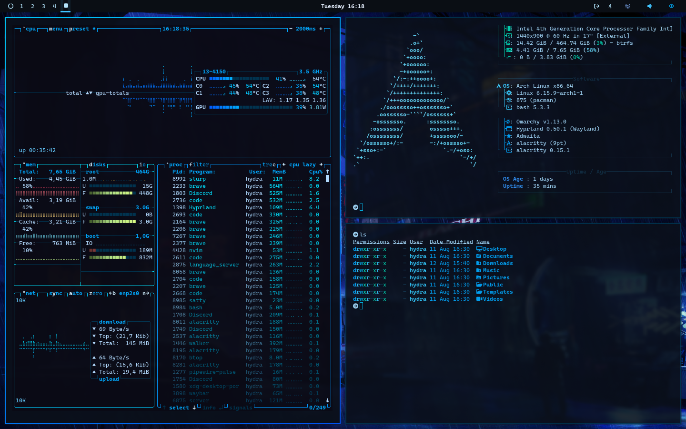

# Azure Glow Theme

A deep, cyber-ocean aesthetic — shadowy bases lit by bright azure and electric teal highlights. Designed for people who want their desktop to feel like it’s running on pure bioluminescence.



---

## Design Notes
- **True depth**: Midnight backgrounds with subtle gradients
- **Pops of light**: Vivid blues that feel alive in the dark
- **Readable at a glance**: High-contrast, glow-ready palette
- **One vision, everywhere**: Synced colors across terminal, bar, lock screen, and notifications

---

## Color DNA

### Core Shades
| Purpose     | Hex       | Name                   |
|-------------|-----------|------------------------|
| Background  | `#0a0f14` | Abyss Black-Blue        |
| Foreground  | `#a9dfff` | Soft Ice Blue           |
| Secondary   | `#101820` | Deep Graphite           |

### Accents
| Role     | Hex       | Description              |
|----------|-----------|--------------------------|
| Primary  | `#00bfff` | Neon Azure                |
| Secondary| `#00e0ff` | Electric Cyan             |
| Success  | `#2affd5` | Aqua Mint                 |
| Warning  | `#ffd43b` | Soft Amber                |
| Error    | `#ff4c4c` | Signal Red                |
| Info     | `#33d4ff` | Sky Glow                  |

---

## Terminal Palette

| Color    | Normal    | Bright    |
|----------|-----------|-----------|
| Black    | `#101820` | `#1c2833` |
| Red      | `#ff4c4c` | `#ff6b6b` |
| Green    | `#2affd5` | `#4dffd9` |
| Yellow   | `#ffd43b` | `#ffdf70` |
| Blue     | `#00bfff` | `#4dcfff` |
| Magenta  | `#9a6bff` | `#b594ff` |
| Cyan     | `#00e0ff` | `#4deeff` |
| White    | `#a9dfff` | `#ffffff` |

---

## What’s Themed
- **Alacritty** — deep ocean backdrop with crisp, glowing colors
- **Hyprland** — azure → cyan gradient active borders
- **Waybar** — cool-tone indicators with subtle luminance
- **Mako** — glowing borders on notifications
- **Btop** — gradients that mimic underwater light rays
- **Neovim** — syntax colors matched to the Azure Glow palette
- **Hyprlock** — soft blue glow lock screen motif

---

## Install
To install this theme, use the `omarchy-theme-install` command:

```bash
omarchy-theme-install https://github.com/Hydradevx/omarchy-azure-glow-theme
```

---

## Wallpaper Ideas
- Minimalist dark blue gradients with glow streaks
- Underwater photography with bright blue plankton
- Futuristic cityscapes at night with cyan lighting
- Abstract lightwave renders

---

**Tip:** Works beautifully with transparent windows and background blur for a real “underwater cyberpunk” vibe.
