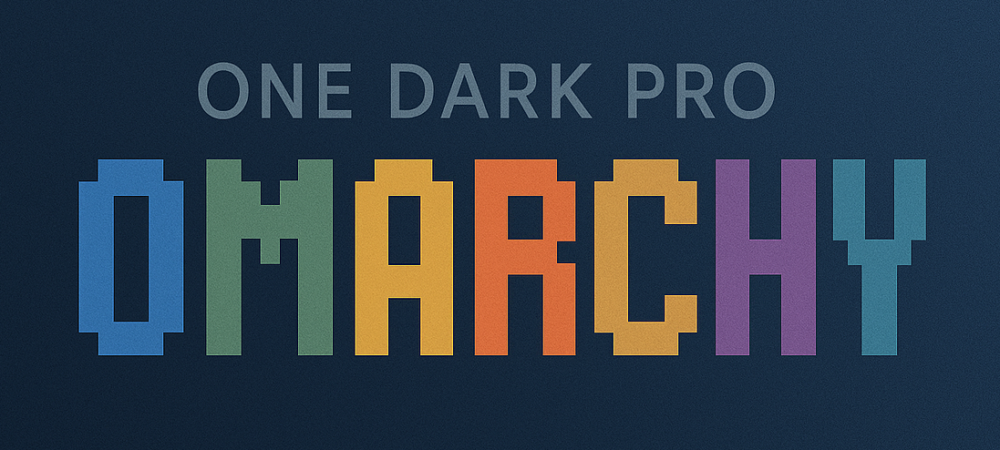
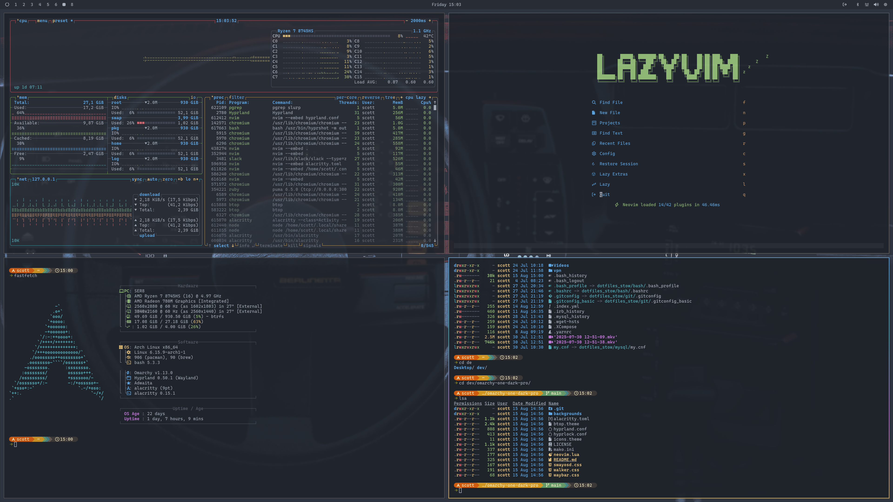
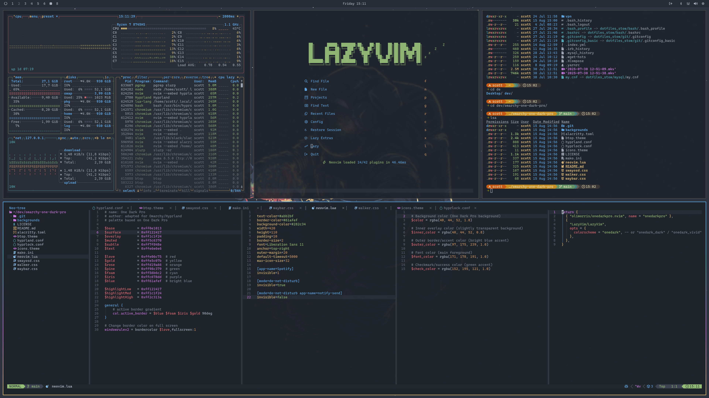

# One Dark Pro Theme for Omarchy



A One Dark Pro theme for [Omarchy](https://omarchy.org/), inspired by the popular One Dark Pro editor color scheme.

### Dark:




### Prompt:

The [Starship](https://starship.rs) prompt is based off [gruvbox-rainbow Preset](https://starship.rs/presets/gruvbox-rainbow). Currently you will need to copy [starship.toml](./starship.toml) to your `~/.config` folder.

## Installation

Use the built-in installation script (available after version 1.4.0):

Dark:
```bash
omarchy-theme-install https://github.com/sc0ttman/omarchy-one-dark-pro
